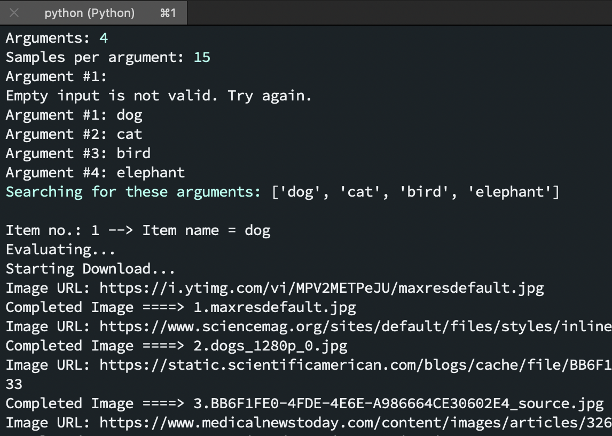

# Custom Image Scraper
### A simple Python console app.

* Making for the <b>CS324 Scripting Languages</b> course.
* Redone for Python 3.6.
* Made with PyCharm.

## External requirements

For base scraping: [google_images_download](https://github.com/hardikvasa/google-images-download) python package. 

Note: I only found this package with pip.
```
pip install google_images_download
```

Web driver #1: [selenium](https://selenium-python.readthedocs.io/installation.html) web driver python package.
```
pip install selenium
```

Web driver #2: [chromedriver](http://chromedriver.chromium.org/downloads) web driver for Google Chrome. You'll need to provide a path to the chromedriver executable on you computer in the processing.py file.

Web drivers are needed for downloading more than 200 image files per argument.

## Internal requirements
For renaming and resizing of images: [renaming-resizing-script](https://github.com/AndrijaS37N/renaming-resizing-script) which is my own project. 
Be advised that this project has its own requirements. This bash script I've made it already present for this project, hence the term <b>internal</b>.

## Alternatives
Inspect the <b>alts</b> folder for a bing alternative scraping script which isn't made originally by me.

~~Option #1: For Google scraping check out [this link](https://gist.github.com/genekogan/ebd77196e4bf0705db51f86431099e57#file-scrapeimages-py). I haven't tried out any of them yet.
The example that I've placed in the alts folder requires the [beautifulsoup4](https://pypi.org/project/beautifulsoup4/) library.~~ This option was deleted.

Option #1: A Bing searching API provided for students; a [Microsoft Azure](https://azure.microsoft.com/en-us/services/cognitive-services/bing-web-search-api/) account is needed for a key to use in the scraping script.
You'll also need these two for this script:
```
pip install requests
```
```
pip install opencv-python
```

## Usage
Change directory to the <b>code</b> folder and then type in this command in the terminal:
```
python main.py
```

Voilà. Make sure to primarily activate your virtual environment of course.
Just a reminder. 
```
# for Anaconda
source activate 'the-name-of-your-env'
```
```
# for venv
source 'venv/bin/activate'
```

Please <b>read the comments</b> in the code in order to better understand the execution of the program.

#### Project results:
<h6>Boot &#x2198;</h6>

<h6>Search Args &#x2198;</h6>

<h6>Work I &#x2198;</h6>

<h6>Work II &#x2198;</h6>

<h6>Work III &#x2198;</h6>

<h6>Work IV &#x2198;</h6>

<h6>Script Finished &#x2198;</h6>


